  <picture>
    <source media="(max-width: 760px) and (prefers-color-scheme: dark)" srcset="./assets/hero/hero-mobile-dark.svg">
    <source media="(max-width: 760px)" srcset="./assets/hero/hero-mobile-light.svg">
    <source media="(prefers-color-scheme: dark)" srcset="./assets/hero/hero-dark.svg">
    <source media="(prefers-color-scheme: light)" srcset="./assets/hero/hero-light.svg">
    
  </picture>

## Hey, I'm Rohit

I'm a student at **Dr B R Ambedkar National Institute of Technology, Jalandhar**, and an **AI and full-stack builder**. I build **LLM applications, retrieval systems, and streaming platforms**, usually starting from a problem I actually have and working it into a tool.

## What I Build

- **LLM applications:** long-context memory, story bibles, and context compilers that keep a model consistent across hundreds of chapters.
- **Retrieval (RAG):** hybrid BM25 + dense search, embeddings, and retrieval evaluation (Hit@K, Recall@K, MRR).
- **Full-stack & streaming:** web apps with a clean UI, a pluggable backend, and room for real data sources.
- **Applied ML:** comparing classical and neural models on real engineering datasets.

## Selected Work

| Project | What it does | Stack |
| --- | --- | --- |
| [**WritingDao**](https://github.com/Rohit-rockan/writingdao) | A local-first context compiler and memory OS that lets an LLM write long, coherent series without losing the plot. CLI + browser extension. | TypeScript · Node.js · MCP |
| [**novel-rag**](https://github.com/Rohit-rockan/novel-rag) | Hybrid BM25 + dense retrieval over a fiction library, fused with Reciprocal Rank Fusion and measured with an eval harness. | Python · SQLite FTS5 · sqlite-vec |
| [**Nompyr**](https://github.com/Rohit-rockan/nompyr) · [Live](https://nompyr.vercel.app) | An anime discovery and streaming platform with search, schedules, watch history, and a multi-source provider layer. | JavaScript · Python |
| [**Hydraulic Conductivity**](https://github.com/Rohit-rockan/hydraulic_conductivity) | Predicts soil hydraulic conductivity with ANN, Random Forest, SVM, PSO-RF and TSK fuzzy models, exported to an in-browser calculator. | Python · Jupyter · JavaScript |

## Tools I Use

`Python` · `TypeScript` · `JavaScript` · `Node.js` · `SQLite` · `Jupyter` · `Voyage AI` · `Claude` · `Gemini` · `MCP`

## Contribution Trail

  <picture>
    <source media="(prefers-color-scheme: dark)" srcset="https://raw.githubusercontent.com/Rohit-rockan/Rohit-rockan/output/github-snake-dark.svg">
    <source media="(prefers-color-scheme: light)" srcset="https://raw.githubusercontent.com/Rohit-rockan/Rohit-rockan/output/github-snake.svg">
    
  </picture>

<strong>Recent public activity</strong>

 

<!-- AUTO:ACTIVITY:START -->
- Oct 6, 2026: created a branch in [Rohit-rockan/novel-rag](https://github.com/Rohit-rockan/novel-rag).
- Oct 6, 2026: pushed 1 commit to [Rohit-rockan/novel-rag](https://github.com/Rohit-rockan/novel-rag).
<!-- AUTO:ACTIVITY:END -->

---

  Building useful tools around LLMs, retrieval, and the web.

